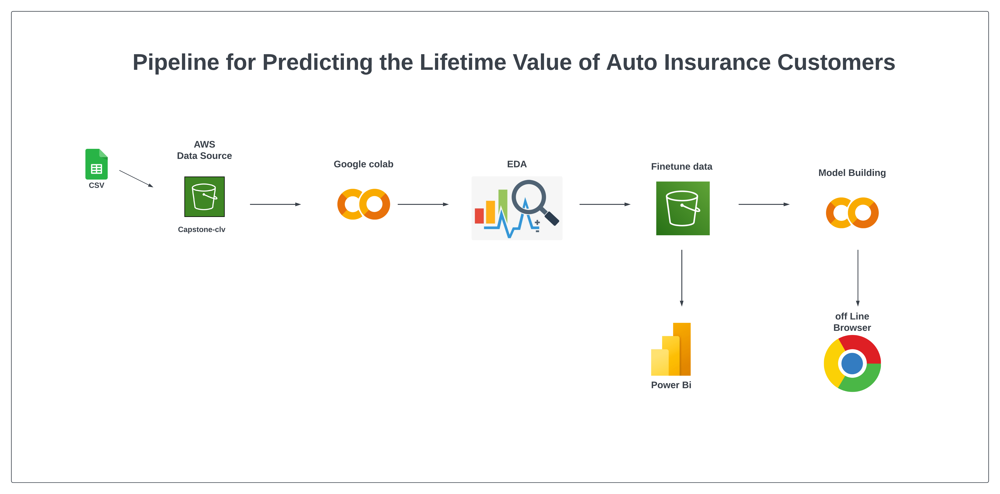
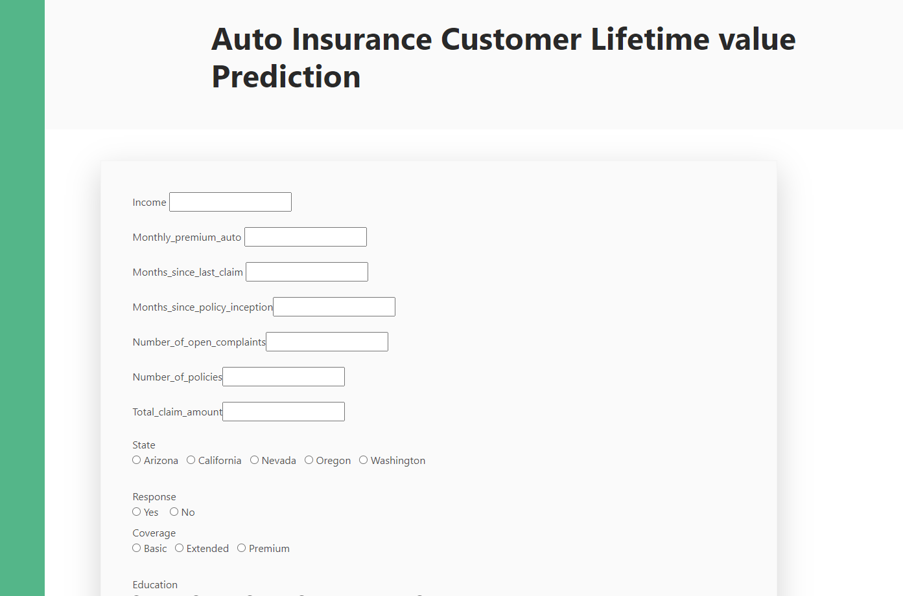
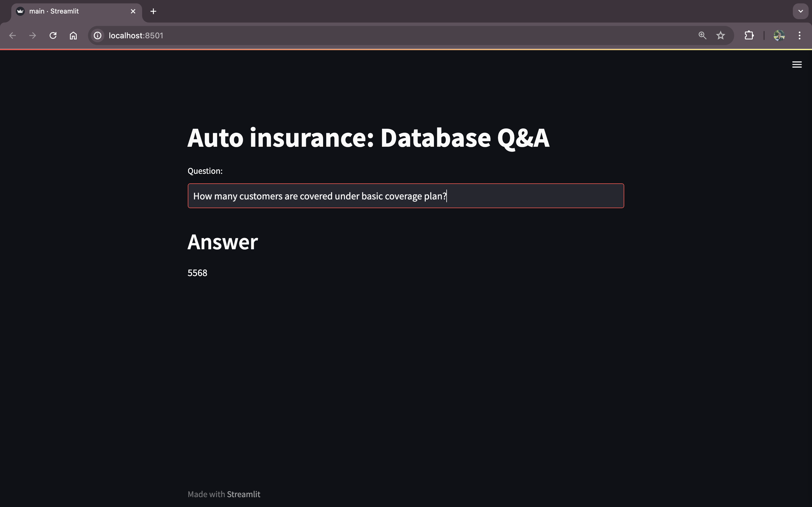

# Customer Lifetime Value Prediction for Auto-Insurance Companies
Auto Insurance Customer Lifetime Value Prediction and Analysis

## Team 4: Data Walkers
Kumbam Nithin Goud  
Rindhuja Treesa Johnson  
Prudhvi Yaswanth Mundluri  

## Business Problem
An Auto Insurance company X in the USA is facing issues in retaining its customers and wants to advertise promotional offers for its loyal customers. They are considering Customer Lifetime Value CLV as a parameter for this purpose.  
Customer Lifetime Value (CLV) signifies the worth of a customer to a company across a specified duration.  In the insurance sector, where competition is intense, customers consider more than just insurance premiums when making decisions.  Customer Lifetime Value (CLV), being centered on the customer, offers a strong foundation for retaining high-value clients, earning more from lower-valued clients, and improving overall customer satisfaction. Effectively leveraging CLV can result in better customer acquisition and retention, decreased churn rates, informed marketing budget planning, detailed ad performance measurement, and numerous other advantages.

## Project Goal
To address customer retention challenges faced by a US auto insurance company X by leveraging Customer Lifetime Value (CLV) prediction and analysis.

## Methodology
**Data Analysis with Python:** Utilized Python libraries for data cleaning and pre-processing, ensuring data quality for accurate model training and analysis. 

**Machine Learning for CLV Prediction:** Developed and implemented a machine learning model to predict individual customer lifetime value, enabling the identification of high-value customers for targeted retention strategies. 

**Interactive Visualizations with Power BI:** Developed interactive dashboards using Power BI to visualize key CLV insights and trends, facilitating data-driven decision making for marketing and customer retention initiatives. 

**Q&A LLM Model with Gemini:** Built a question-answering system using the Gemini large language model on the insurance database, enabling Auto insurance company to easily retrieve specific information and gain deeper understanding of the data. 

## Impact
<ul>
  <li> <b>Improved Customer Retention:</b> Identified high-value customers for targeted promotional offers and loyalty programs, leading to increased customer retention and reduced churn rates.</li>
  <li><b>Enhanced Marketing Effectiveness:</b> Enabled data-driven allocation of marketing resources towards high-value customer segments, maximizing return on investment.</li>
  <li><b>Data-driven Decision Making:</b> Empowered stakeholders with CLV insights and interactive visualizations, facilitating informed decisions regarding customer acquisition, retention, and overall business strategy.</li>
  <li><b>Enhanced User Experience:</b> Provided a user-friendly Q&A interface for easy access to information, promoting data democratization and knowledge sharing within the organization reducing the time required for developing efficient SQL queries..</li>
</ul>  

## Technical Skills Demonstrated
<b>Programming Language:</b> Python 
**Scripting Languages:** HTML, CSS, JS  
**Databases:** MySQL 
**Tools and Technologies:**  AWS, MS Power​BI, MS Excel, GitHub  
**IDE:** Jupyter ​Notebook, Visual ​Studio ​Code  
**API:** Gemini LLM, AWS S3, MySQL

This project showcases expertise in leveraging data science and machine learning to solve real-world business problems, specifically within the auto insurance industry. The developed solution provides a comprehensive framework for understanding, predicting, and utilizing customer lifetime value to improve customer retention and drive business growth. 

## Dataset Description
The dataset represents Customer lifetime value of an Auto Insurance industry in the United States, it includes over 24 features and 9134 records to analyze the lifetime value of Customer.

## Data Source and References

- Data Source: [IBM Watson Marketing Customer Value Data](https://www.kaggle.com/datasets/pankajjsh06/ibm-watson-marketing-customer-value-data)
- Danao, M. (2023). What is Customer Lifetime Value (CLV). Forbes Advisor.
[Go to the Website](https://www.forbes.com/advisor/business/customer-lifetime-value/#:~:
text=What%20is%20customer%20lifetime%20value%20and%20why%20is%20it%
20important,and%20increase%20profits%20over%20time)
- LangChain, I. (2024a). LLMs. [Go to the page](https://python.langchain.com/docs/integrations/llms/)
- LangChain, I. (2024b). SQL Database. [Go to the page](https://python.langchain.com/docs/integrations/tools/sql_database/)
- Ross, S. (2021). How do insurance companies make money? Business Model Explained.
Investopedia. [Go to the Website](https://www.investopedia.com/ask/answers/052015/what-main-business-
model-insurance-companies.asp#:~:text=The%20essential%20insurance%20model%
20involves,into%20other%20interest%2Dgenerating%20assets)
